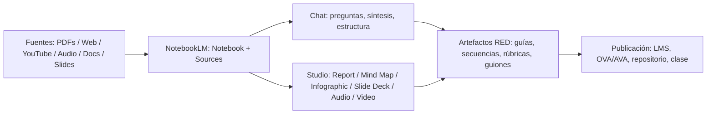

# NotebookLM en Educación  
## Diseñar Recursos Educativos Digitales (RED) con fuentes “ancladas” y resultados listos para aula

> **Idea fuerza:** NotebookLM te ayuda a **transformar fuentes** (PDF, sitios web, videos de YouTube, audios, Docs/Slides) en **productos educativos** (guiones, storyboards, guías didácticas, infografías, presentaciones, audio/video explicativos), manteniendo la trazabilidad mediante **citas en línea**.

---

## Índice de Contenido
1. [¿Qué es NotebookLM y por qué sirve para RED?](#qué-es-notebooklm-y-por-qué-sirve-para-red)
2. [¿Cómo funciona NotebookLM? (Tecnología en la que se basa)](#cómo-funciona-notebooklm-tecnología-en-la-que-se-basa)
3. [Flujo de trabajo para crear RED (paso a paso)](#flujo-de-trabajo-para-crear-red-paso-a-paso)
   - [1) Reúne las fuentes](#1-reúne-las-fuentes)
   - [2) Selecciona las fuentes](#2-selecciona-las-fuentes)
   - [3) Personaliza tu elección](#3-personaliza-tu-elección)
   - [4) Genera y revisa](#4-genera-y-revisa)
   - [5) Descarga](#5-descarga)
   - [6) Comparte](#6-comparte)
4. [Casos de uso: Metodologías creativas](#casos-de-uso-metodologías-creativas)
5. [El arte del buen prompt](#el-arte-del-buen-prompt)
   - [1) Prompt profesional](#1-prompt-profesional)
   - [2) Prompt para estilo y diseño (con estilos)](#2-prompt-para-estilo-y-diseño-con-estilos)
   - [3) Prompt para investigación](#3-prompt-para-investigación)
   - [4) Prompt para educación (diseñar contenidos educativos digitales)](#4-prompt-para-educación-diseñar-contenidos-educativos-digitales)
6. [Limitaciones](#limitaciones)
7. [Ejemplos visuales y audiovisuales (YouTube)](#ejemplos-visuales-y-audiovisuales-youtube)
8. [Créditos y licencia](#créditos-y-licencia)

---

## ¿Qué es NotebookLM y por qué sirve para RED?
NotebookLM funciona como un **asistente de lectura, síntesis y producción** para educadores y diseñadores instruccionales:

- **Convierte fuentes en claridad:** resume, explica, propone estructuras y genera borradores (con referencias a tus fuentes).
- **Acelera el diseño instruccional:** pasa de “documentos sueltos” a **artefactos** como guías didácticas, secuencias, rúbricas, guiones y presentaciones.
- **Produce formatos listos para compartir:** por ejemplo, **Infographic**, **Slide Deck**, **Audio Overview** y **Video Overview** (según disponibilidad de la cuenta y la región).

> En educación, esto significa menos tiempo “copiando y pegando” y más tiempo **validando, didactizando y diseñando experiencias**.

---

## ¿Cómo funciona NotebookLM? (Tecnología en la que se basa)
NotebookLM se apoya en dos ideas clave:

### 1) Modelo de lenguaje + razonamiento sobre tus documentos  
Un modelo de IA “lee” tus fuentes y conversa contigo para **explicar, resumir y estructurar** lo que hay en ellas.

### 2) “Source grounding” (respuestas ancladas a tus fuentes)
A diferencia de un chat genérico, NotebookLM prioriza **lo que tú subes/seleccionas**. Cuando preguntas, el sistema:
- **recupera fragmentos relevantes** de tus fuentes,
- **construye una respuesta** con base en esos fragmentos,
- y (en muchas funciones) muestra **citas** para verificar.

> Traducción didáctica: *menos alucinación… pero igual hay que revisar.*  
> Regla de oro: **si no está en la fuente, no lo inventes; si está, cítalo.**

---

## Flujo de trabajo para crear RED (paso a paso)

### Vista general (pipeline)


---

### 1) Reúne las fuentes
**Objetivo:** construir el “corpus” que define el conocimiento del RED.

Checklist rápido:
- ✅ Programa/competencias/resultados de aprendizaje (RA)
- ✅ Bibliografía base (capítulos, artículos, políticas, estándares)
- ✅ Material institucional (plantillas, lineamientos, branding)
- ✅ Recursos multimedia (videos/charlas/entrevistas)
- ✅ Evidencias de contexto (diagnóstico, encuestas, necesidades)

Tip: Convierte “material disperso” en **fuentes limpias** (PDFs bien nombrados, Docs con títulos claros, enlaces estables).

---

### 2) Selecciona las fuentes
**Objetivo:** evitar el “síndrome de biblioteca infinita”.

Acciones recomendadas:
- Agrupa por propósito: *marco teórico / didáctica / evaluación / casos / normativa*.
- Mantén un set “mínimo viable” (5–12 fuentes) para el primer borrador.
- Luego amplía por iteraciones.

---

### 3) Personaliza tu elección
**Objetivo:** guiar la IA con contexto pedagógico y editorial.

Define desde el inicio:
- Público: grado/semestre, prerequisitos, contexto.
- Producto: OVA/Guía/Clase/Unidad/Actividad/Rúbrica.
- Restricciones: duración, tono, nivel de profundidad, enfoque (por competencias, ABP, DT, etc.).
- Estilo: formal, cercano, institucional, narrativo, etc.

**Plantilla de contexto (pegar al inicio del chat del notebook):**
- Rol: “Eres diseñador instruccional y experto en RED.”
- Audiencia: “Estudiantes de ___ con ___.”
- Entregable: “Genera ___ en formato ___.”
- Criterios: “Debe incluir ___ y cumplir ___.”

---

### 4) Genera y revisa
**Objetivo:** producir borradores rápidos + control de calidad.

**Ciclo recomendado (iterativo):**
1. Genera estructura (índice, mapa, storyboard).
2. Genera contenido por bloques (microcontenidos).
3. Revisa con checklist pedagógico.
4. Refina con prompts de mejora.
5. Extrae productos finales (slides/infografía/audio/video si aplica).

**Checklist pedagógico (mínimo):**
- Alineación RA ↔ actividades ↔ evaluación.
- Claridad instruccional (qué, cómo, cuándo, con qué evidencia).
- Accesibilidad (lenguaje claro, segmentación, alternativas textuales).
- Activación + práctica + evidencia (no solo lectura).
- Retroalimentación (criterios observables).

---

### 5) Descarga
**Objetivo:** convertir artefactos en archivos reutilizables.

Según el tipo de salida (Studio):
- **Infographic** → descarga como **PNG**.
- **Slide Deck** → descarga como **PDF**.
- **Audio Overview** → descarga el archivo de audio.
- **Video Overview** → descarga el archivo de video.

Para texto (guías, secuencias, rúbricas):
- Copia a Docs/Word y da formato institucional (portada, estilos, referencias).

---

### 6) Comparte
**Objetivo:** distribuir el RED a estudiantes/equipo.

Opciones típicas:
- Compartir el **notebook** (público o con usuarios específicos).
- Compartir solo “chat” (si tu plan lo permite) para que el usuario consulte sin tocar fuentes/artefactos.
- Publicar exportables: PNG/PDF/audio/video en el LMS o repositorio.

Sugerencia: define una política interna:
- ✅ qué se comparte (y qué no),
- ✅ con quién,
- ✅ bajo qué licencia,
- ✅ con qué nivel de trazabilidad.

---

## Casos de uso: Metodologías Creativas

> En cada caso: **Entrada (fuentes) → Proceso (prompts) → Salida (artefacto RED)**

### 1) Investigación a Visualizaciones
**Salida ideal:** infografía + esquema de clase.
- Fuentes: artículos, capítulos, normativa, datasets (si aplica).
- Producto: *Infographic* con definiciones, comparaciones, pasos.

**Prompt sugerido:** “Convierte estas fuentes en una infografía didáctica con 5 secciones: concepto, componentes, ejemplo, errores comunes, mini-evaluación.”

---

### 2) Notas a Presentación
**Salida ideal:** Slide Deck + guion del docente.
- Fuentes: notas de clase + bibliografía + objetivos.
- Producto: Slide Deck (10–15 diapositivas), con una diapositiva final de actividad.

---

### 3) Brainstorming Visual
**Salida ideal:** mapa mental + backlog de recursos.
- Fuentes: lluvia de ideas (Doc), tendencias, referencias.
- Producto: Mind Map + lista priorizada de artefactos (RED v1, v2, v3).

---

### 4) Estilo de Marca
**Salida ideal:** “guía express” de diseño didáctico.
- Fuentes: manual de marca + lineamientos institucionales.
- Producto: checklist: tipografías, tono, estructura, iconografía, colores, uso de logos.

---

### 5) Storytelling con Datos
**Salida ideal:** narrativa + visual + actividad.
- Fuentes: reportes, cifras, casos reales.
- Producto: guion narrativo (inicio–conflicto–resolución) + 3 preguntas de análisis.

---

### 6) Contenido a Storybook
**Salida ideal:** cuento/relato didáctico (microcapítulos) + guía.
- Fuentes: teoría + casos + ejemplos.
- Producto: storybook (5–7 escenas) con preguntas de comprensión y reto final.

---

### 7) Fotos a libro de receta
**Nota:** si tus “fotos” no son importables como fuente directa, conviértelas a PDF/Doc (con texto) y súbelas.
**Salida ideal:** recetario estructurado + lista de compras + tips.
- Fuentes: recetas (PDF/Docs), notas, videos.
- Producto: capítulos por categorías + tabla “tiempo/dificultad/ingredientes”.

---

### 8) Diseño a la Carta
**Salida ideal:** RED personalizado por perfil del estudiante.
- Fuentes: perfiles, diagnóstico, rúbricas, contenidos.
- Producto: 3 rutas (básica/intermedia/avanzada) con actividades equivalentes.

---

## El arte del buen prompt

### Principios (rápidos, pero letales)
- **Define rol + audiencia + entregable + criterios** (si falta uno, la IA improvisa).
- Pide **estructura antes que prosa**.
- Exige **trazabilidad**: “incluye citas y menciona qué fuente respalda cada sección”.
- Trabaja por iteraciones: “v1 → crítica → v2”.

---

### 1) Prompt profesional
```text
Rol: Eres diseñador instruccional experto en Recursos Educativos Digitales.
Contexto: [describe curso/módulo, RA, duración, plataforma]
Tarea: Genera un [entregable] con esta estructura: [índice].
Criterios: 
- Alineación RA ↔ actividades ↔ evaluación.
- Lenguaje claro y segmentado (microcontenidos).
- Incluye 1 actividad práctica + 1 evidencia evaluable.
- Señala con citas qué fuente respalda cada apartado.
```

---

### 2) Prompt para estilo y diseño (con estilos)
**Catálogo de estilos (elige 1 y dilo explícitamente):**
- Minimalista académico
- Institucional corporativo
- Flat educativo (iconos + bloques)
- Isométrico tecnológico (si aplica)
- Narrativo/storytelling
- Visual tipo “cheat sheet” (resumen imprimible)

**Prompt base:**
```text
Genera una Infographic y/o Slide Deck con estilo: [elige uno del catálogo].
Parámetros de diseño:
- Paleta: [colores o “neutros + 1 acento”]
- Tipografía sugerida: [serif/sans]
- Densidad: baja/media/alta (prioriza legibilidad)
Requisitos didácticos:
- 5 secciones máximo
- 1 ejemplo aplicado
- 3 preguntas de autoevaluación al final
Incluye: títulos cortos, bullets, y un cierre “para llevar”.
```

---

### 3) Prompt para investigación
```text
A partir de las fuentes seleccionadas:
1) Extrae conceptos clave (con definición breve).
2) Identifica tensiones/debates (2–3).
3) Construye una síntesis en 7–10 bullets.
4) Propón 5 preguntas de investigación (nivel posgrado).
5) Señala citas para cada concepto y para cada afirmación importante.
```

---

### 4) Prompt para educación (diseñar contenidos educativos digitales)
```text
Diseña un RED para enseñar: [tema].
Audiencia: [perfil].
Resultados de aprendizaje (RA): [lista].
Entregables:
A) Guía didáctica (objetivo, recursos, paso a paso, evidencias).
B) Actividad evaluable con rúbrica (4 criterios, 4 niveles).
C) Guion breve para microvideo (2–3 min).
D) 1 Infographic o 1 Slide Deck (elige según pertinencia).
Condiciones:
- Incluye instrucción clara al estudiante.
- Incluye retroalimentación (qué se evalúa y cómo mejorar).
- Usa únicamente lo sustentado por las fuentes y marca citas.
```

---

## Limitaciones

### 1) Inexactitudes fácticas y visuales
- Aunque haya “grounding”, puede haber errores de interpretación, omisiones o generalizaciones.
- En outputs multimedia (audio/video/diapositivas) pueden aparecer fallos (p. ej., glitches de voz, simplificaciones visuales).

**Mitigación:**
- Pide siempre “lista de afirmaciones verificables + citas”.
- Revisa con checklist y corrige antes de publicar.

---

### 2) Privacidad de datos
- Evita subir: datos sensibles de estudiantes, información clínica/financiera, documentos con restricciones.
- Si trabajas con cuentas institucionales, define políticas con el área de TI/jurídica.

**Mitigación:**
- Anonimiza y minimiza.
- Trabaja por capas (fuentes públicas → borrador → integración con datos internos solo si es imprescindible).

---

### 3) Planes y precios
Los límites y funciones premium pueden variar por región/plan (y cambian con el tiempo).

**Recomendación práctica:**
- Si estás en fase de diseño: plan gratuito puede bastar.
- Si produces en volumen (muchos notebooks, fuentes y artefactos): evalúa plan con límites ampliados.

Consulta siempre la página oficial de planes de tu país antes de decidir.

---

## Ejemplos visuales y audiovisuales (YouTube)

> Puedes incrustar miniaturas con este formato:
> `[](https://www.youtube.com/watch?v=VIDEO_ID)`

### Tutoriales generales
- [](https://www.youtube.com/watch?v=UG0DP6nVnrc)
- [](https://www.youtube.com/watch?v=Mn9r07wJjbc)
- [](https://www.youtube.com/watch?v=FOs4RDTC52Q)

### Enfoque educativo
- [](https://www.youtube.com/watch?v=z--9WImDTOw)

### Audio Overviews (para microclases y cápsulas)
- [](https://www.youtube.com/watch?v=Fl22rLIdZNQ)

---

## Créditos y licencia

**Elaborado por:** Joaquin Lara Sierra  
**Licencia:** Creative Commons **Atribución – No Comercial – Compartir Igual** (CC BY-NC-SA)

> Puedes reutilizar y adaptar este material **atribuyendo autoría**, **sin fines comerciales** y **manteniendo la misma licencia** en obras derivadas.

---
_Fin._
